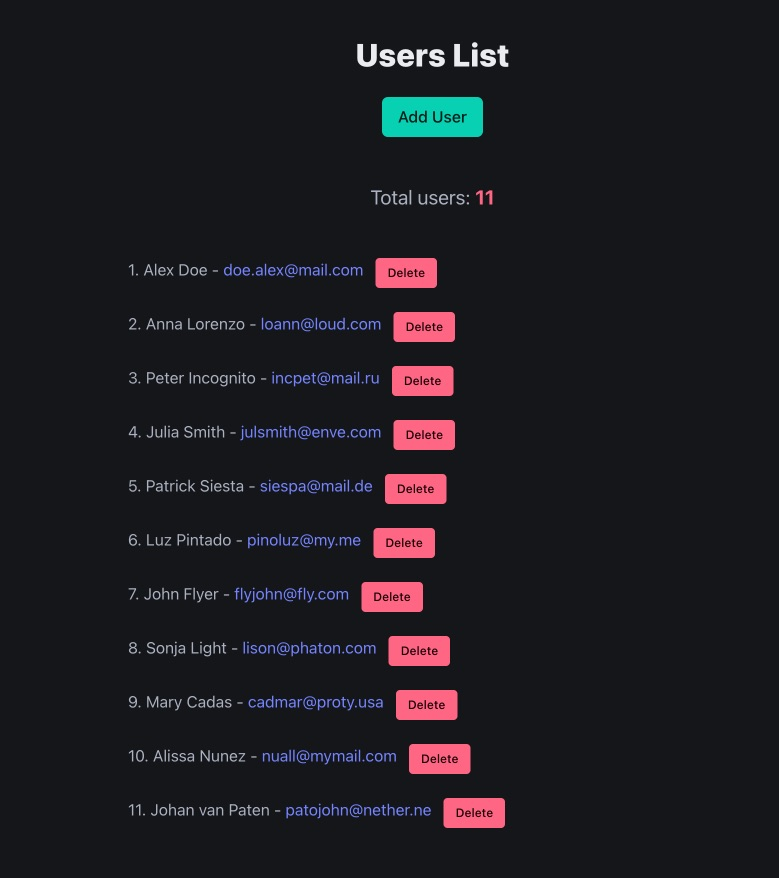
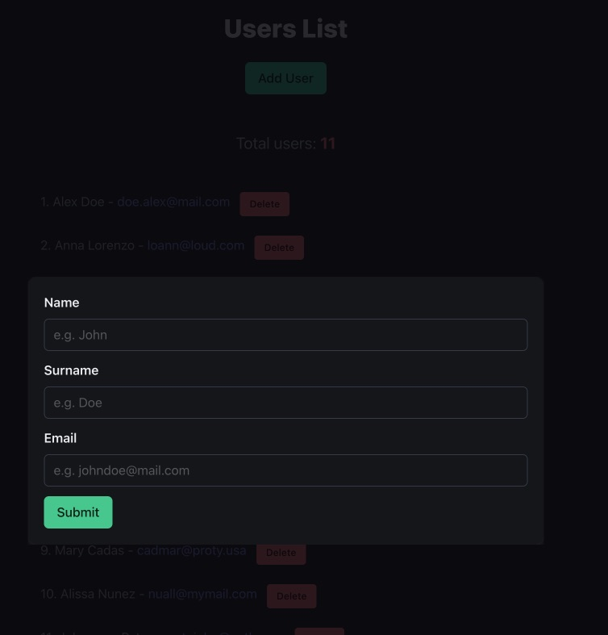

<!-- @format -->

# CRUD Web App Lista de usuarios

Este es un proyecto de aplicación web CRUD que permite crear, listar y eliminar usuarios. La aplicación utiliza un formulario modal para ingresar los datos del usuario y muestra una lista de los usuarios creados en la página principal.

## Características

- **Crear Usuarios:** Los usuarios se crean ingresando nombre, apellido y correo electrónico en un formulario modal.
- **Listar Usuarios:** La página principal muestra una lista de todos los usuarios creados.
- **Eliminar Usuarios:** Cada usuario en la lista tiene un botón “Eliminar” para borrar el usuario correspondiente.
- **Contador de Usuarios:** La página muestra el total de usuarios creados y listados.

## Tecnologías Utilizadas

- **Bulma CSS:** Para el diseño y estilo de la aplicación.
- **Express:** Para manejar las solicitudes del servidor.
- **Vanilla JS:** Para la lógica del lado del cliente.
- **Git:** Para el control de versiones.
- **pnpm:** Para gestionar las dependencias del proyecto.
- **fs (File System):** Para manejar la creación y almacenamiento de usuarios en un archivo JSON que funciona como base de datos.

## Retos Encontrados

1. Estilos con Bulma: Aplicar correctamente las clases de Bulma para centrar elementos en el canvas fue un desafío. Se requirió ajustar las clases y estilos para lograr el diseño deseado.
2. Borrado de Usuarios: Hubo problemas al eliminar usuarios debido a que los IDs no se estaban parseando correctamente. Los tipos de ID en la función `filter` no coincidían, lo que causaba errores al intentar eliminar un usuario.

## Instalación

1. Clona este repositorio:`https://github.com/juaneugenio/classroom-list.git`
2. Navega al directorio del proyecto:`cd classroom-list`
3. Instala las dependencias: `pnpm install`
4. Inicia la aplicación: `pnpm start`

## Uso

- Accede a la aplicación en tu navegador web en `http://localhost:3000`.
- Usa el botón para abrir el formulario modal y crear nuevos usuarios.
- Visualiza la lista de usuarios en la página principal y utiliza el botón “Eliminar” para borrar usuarios.

## Contribuciones

Las contribuciones son bienvenidas. Por favor, abre un issue o envía un pull request para mejorar este proyecto.

## Licencia

Este proyecto está bajo la Licencia MIT.
Espero que este formato te sea útil para documentar tu proyecto. Puedes ajustar los detalles según sea necesario.

## Capturas

1. Lista de ususarios

2. Formulario para crear usuarios.

